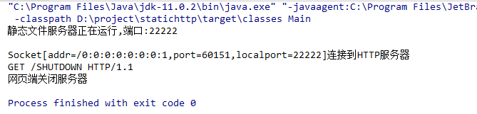

# statichttp

## 介绍

使用Java实现一个静态资源HTTP服务器，可以读取静态文件，缓存静态资源，使用gzip压缩资源，MIME类型支持，多线程处理响应。可以根据配置，设置静态目录和服务器ip端口号。

## 工具

- Java（1.11）
- Maven
- IDEA

## 说明

biostatichttp包展示：

- com.biostatichttp.Main.java：主程序运行类
- HttpServer.java：服务器类
- Request.java：Request响应封装
- Response.java：Response响应封装
- Handler.java：处理类
- MIME.java：MIME类型封装
- MD5Util.java：别人写的md5生成类

niostatichttp包展示：文件说明基本同上，所不同的是，内部实现均改成NIO

niostatichttpmt包展示：

- NioSelectorRunnablePool.java：两个线程池分别管理Boss类的Selector和Worker类的Selector
- AbstractNioSelector：Boss和Worker的抽象类实现，实现了Runnable接口，封装好Selector要做的事情，留下select和process两个抽象方法，由Boss类型和Worker类型的Selector去具体实现，Boss类型负责接收Channel，将其注册到Worker类型的**任务队列**中，等待Worker去处理，Worker类型主要从任务队列中获取任务进行处理。
- Boss，Worker接口：定义了一个注册任务到任务队列方法。

## 截图

**第一次请求资源**

**再次请求资源**

**请求不存在的资源**

**网址栏输入SHUTDOWN，关闭静态资源服务器**

## 更新说明：

- 2019-04-19：完成基本功能

- 2019-04-20：重构代码，主要完成Request和Respon解耦，重构HttpServer和Handler代码

- 2019-05-18: 将BIO，NIO和NIO+线程池写的三个工程目录合并到同一个工程目录
  - biostatichttp：使用Java的IO流实现的，使用线程池处理各种请求

  - niostatichttp：使用NIO实现，IO多路复用的模式，简单的理解NIO中这几个组件的作用，Selector负责接收客户端请求，Channel负责客户端和服务端信息交互，Buffer用于存放数据

  - niostatichttpmt：使用NIO加线程池和多Selector（分成Boss，负责接收请求和Worker，负责处理请求）实现，读了很多文章，发现[这篇文章](https://my.oschina .net/u/3768341/blog/1814575)写的最好，作者抽象封装的能力很强，而且写出来比我原来自己的写的版本好看很多，于是仿照这个作者的模式重写一遍。

    > 有一个奇怪的问题，就是加入线程池和多Selector之后，有时候响应并没有那么快，很奇怪，还没查出来什么原因。